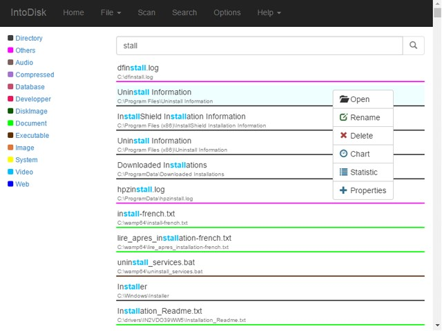

IntoDisk
=========

IntoDisk helps to analyse your disk space and explore it easily.

Description
---
IntoDisk is a tool that helps you to analyse your disk space and explore it easily.
This tool can also scan quickly one or all partitions into hard disk then display statistic about files inside each partitions like: video files percent, audio files, and so on ... . Then you can perform quickly a search for any files or folders.
To avoid other scan after computer restart or after closing the software, it is possible to save the scan results.

Using this tool, you can:
* See all partitions usage;
* Scan all partitions or select a partition to scan;
* See partitions usage statistics after a scan (videos, audio, photos, documents, ...);
* Scan a folder;
* Search quickly files or folders into your hard disk;
* Get files or folders informations;
* Do action on files or folders: rename, delete, properties;
* Save scanned informations to avoid rescanning later.

Screenshots
---





Releases
---

Download releases from some major platforms to use it:
* Linux
  * [x64](https://github.com/arasT/relasT/raw/master/NodeJS/IntoDisk/Linux/x64/IntoDisk-linux-x64-v0.3.0.zip)
  * [x86](https://github.com/arasT/relasT/raw/master/NodeJS/IntoDisk/Linux/x86/IntoDisk-linux-x86-v0.3.0.zip)  
* Windows
  * [x64](https://github.com/arasT/relasT/raw/master/NodeJS/IntoDisk/Windows/x64/IntoDisk-win32-x64-v0.3.0.zip)
  * [x86](https://github.com/arasT/relasT/raw/master/NodeJS/IntoDisk/Windows/x86/IntoDisk-win32-x86-v0.3.0.zip)  
* Mac OS X
  * [x64](https://raw.githubusercontent.com/arasT/relasT/3bca48fce908bcf8e70c467ddedab855ad115b88/NodeJS/IntoDisk/Mac/x64/IntoDisk-darwin-x64-v0.3.0.zip)

Do not hesitate to check other arasT releases at [relasT](https://github.com/arasT/relasT) repository.

How to install
---
No need to install, just extract the downloaded archive file and run the executable inside.

For Mac OS X, copy the app inside the extracted archive into **Application** folder then run it. You may have to allow it from **Security Settings**

How to use from sources
---

This app is based on [Node.js](http://nodejs.org/) and [Electronjs](https://electronjs.org/).
It uses:
* [express](https://expressjs.com/): to have a web server.
* [jade-bootstrap](https://www.npmjs.com/package/jade-bootstrap): to mix Pug and Bootstrap.
* [jsonfile](https://www.npmjs.com/package/jsonfile): to read/write JSON files easily.
* [walkdir](https://www.npmjs.com/package/walkdir): to scan partitions or directories into disks.
* [systeminformation](https://github.com/sebhildebrandt/systeminformation): to get informations about: CPU, RAM, SWAP, Networks, Processes, Mounted files system.
* And some their dependencies

And for client side, it uses:
* [auto-complete](https://github.com/Pixabay/JavaScript-autoComplete): to display suggestion when searching something.
* [bootstrap](https://getbootstrap.com/): to create responsive and beautiful design.
* [bootbox](http://bootboxjs.com/): to create modal dialog box.
* [chart](http://chartjs.org/): to draw statistic chart.
* [colorpicker](https://www.eyecon.ro/colorpicker/): to display color picker.
* [d3](https://d3js.org/): to draw sunburst chart.
* [jquery](https://jquery.com/): javascript library to simply doing things.
* [moment](https://momentjs.com/): to humanize timestamp.
* piechart.js (link not found anymore): to draw pie chart (was hacked).

Clone or Download this repository.
```
git clone https://github.com/arasT/IntoDisk
```
Extract the archive file and move into it.
```
cd IntoDisk
```
Install all node modules for electron.
```
npm install
```
Install all node modules for web.
```
cd http
npm install
```
Install Electron globally on the computer.
```
npm install electron -g
```

Run the app
---
**Note:** it uses **3456** as default port.
Return into the root folder of the app (above 'http' folder), then run electron.
```
cd ..
electron .
```

Build new releases
---
If you want to improve IntoDisk and build new releases, you have to change some paths into some files:
* Into **main.js**: change **options.json** path by commenting the following line:
```
var configPath = './http/public/config/options.json';
```
and uncommenting
```
var configPath = path.join(path.dirname(process.execPath), 'config/options.json');
```
* And, into **'http/routes/options.js'**: change these paths by commenting these following lines:
```
var defaultConfigPath = path.join(__dirname, '../public/config/default_options.json');
var configPath = path.join(__dirname, '../public/config/options.json');

var diExtensionPath = path.join(__dirname, '../public/config/diExtension.json');
var default_diExtensionPath = path.join(__dirname, '../public/config/default_diExtension.json');
```
and uncommenting
```
var defaultConfigPath = path.join(path.dirname(process.execPath), 'config/default_options.json');
var configPath = path.join(path.dirname(process.execPath), 'config/options.json');
var diExtensionPath = path.join(path.dirname(process.execPath), 'config/diExtension.json');
var default_diExtensionPath = path.join(path.dirname(process.execPath), 'config/default_diExtension.json');
```
* Finally, into **'http/routes/search.js'**: change extension path by commenting the following line:
```
var configPath = path.join(__dirname, '../public/config/diExtension.json');
```
and uncommenting
```
var configPath = path.join(path.dirname(process.execPath), 'config/diExtension.json');
```

Then, build stand alone app using [electron-packager](https://github.com/electron-userland/electron-packager).


**IMPORTANT**
* For Linux and Windows, you have to copy **'http/public/config'** folder into root folder of the created package.
* For Mac OS X, copy **'http/public/config'** folder into **'IntoDisk.app/content/MacOS'** folder.
You can take a look at packaged by downloading a release from the **Releases** section above.

License
----

The GPLv2 License.
Further details see LICENSE file.

Contributing
----

Please fork if you want to contribut to this project.
